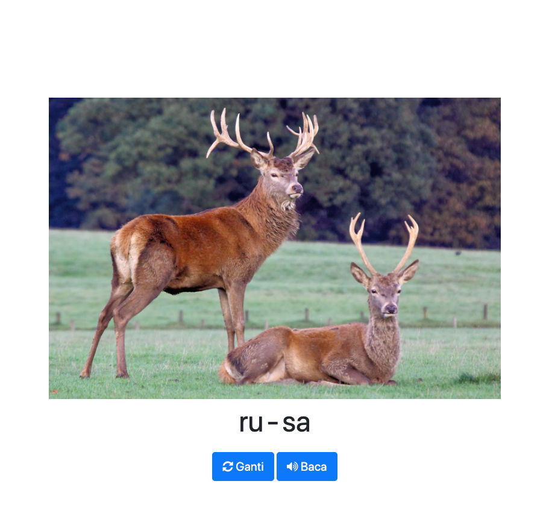

# Belajar Baca

This is web app prototype for helping young children to learn reading in Bahasa Indonesia.

The idea is to show familiar image to the children along with the caption already broken down in syllable. If the children had difficulty in reading the caption, they could simply ask the app to help them reading it.

To read the caption, this app use experimental [Web Speech API](https://developer.mozilla.org/en-US/docs/Web/API/Web_Speech_API/Using_the_Web_Speech_API).

<html>

    

</html>

Demo: https://riandyrn.github.io/belajar-baca/

PRs are welcome! 😃
